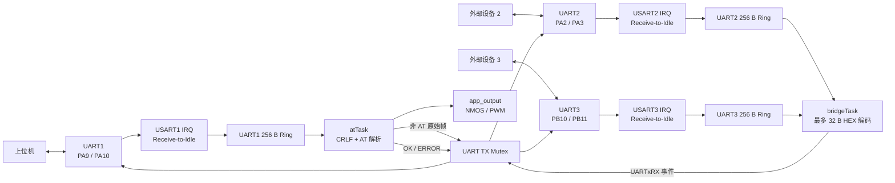

# stem-hub-board2

基于 STM32F103C8、STM32 HAL 和 FreeRTOS 的板2固件。UART1 负责 AT 控制和主机通信，UART2、UART3 可按命令启用为透传目标；应用层同时提供三路高有效 NMOS 输出、一路 25 kHz PWM 和运行状态 LED。

## 快速开始

在 Windows PowerShell 中进入仓库根目录。

### 1. 运行主机测试

主机测试需要 PATH 中存在支持 C11 的 `gcc`：

```powershell
gcc --version
.\tests\run_host_tests.ps1
```

成功时会看到：

```text
PASS test_at_protocol
PASS test_line_reader
PASS test_ring_buffer
PASS test_output_math
PASS test_uart_tunnel
```

### 2. 构建固件

需要 PATH 中存在 CMake、Ninja 和 `arm-none-eabi-gcc`。本工程已使用 STM32Cube 附带的 CMake 4.0.1、Ninja 1.13.1 和 GNU Tools for STM32 13.3.1 验证。

```powershell
cmake --version
ninja --version
arm-none-eabi-gcc --version

cmake --preset Debug
cmake --build --preset Debug

cmake --preset Release
cmake --build --preset Release
```

构建成功后，固件位于：

- `build/Debug/stem-hub-board2.elf`
- `build/Release/stem-hub-board2.elf`

当前 CMake 目标只自动生成 ELF；如下载工具要求 HEX 或 BIN，可使用 `arm-none-eabi-objcopy` 从 ELF 转换。

详细的软件与实板检查步骤见 [TESTING.md](TESTING.md)。

## 功能范围

当前固件实现：

- UART1 上严格大写、CRLF 结尾的 AT 命令解析。
- NMOS1、NMOS2、NMOS3 开关控制。
- PB3 控制 18V Buck、PB12 控制 12V Buck；两路上电默认关闭。
- PB9/TIM4_CH4 的 0%～100% PWM 占空比控制。
- UART2、UART3 单独或同时启用为透传目标。
- UART1 非 AT CRLF 帧向已启用目标原样转发，包括帧内 `0x00`。
- 使用大写 HEX 通过 AT 命令发送最多 32 B 二进制数据。
- UART2、UART3 原始接收数据分块编码为 HEX 事件并返回 UART1。
- UART 接收溢出、超长行和 HAL UART 错误后的清理或恢复。
- FreeRTOS 栈溢出与动态内存分配失败钩子。

本次交付不包含 ADC、电机控制、电源管理、持久化配置和 bootloader。自动测试及固件构建已经完成，实板烧录与电气验收仍需按 [TESTING.md](TESTING.md) 执行。

## 硬件资源与默认状态

三路 UART 均为 `115200、8N1、无硬件流控`。

| 功能 | MCU 资源 | 有效电平或方向 | 软件启动后的默认状态 |
| --- | --- | --- | --- |
| UART1 | PA9=TX、PA10=RX | 主控制串口 | 接收已启动 |
| UART2 | PA2=TX、PA3=RX | 透传串口 | 透传关闭，接收已启动 |
| UART3 | PB10=TX、PB11=RX | 透传串口 | 透传关闭，接收已启动 |
| NMOS1 | PB4 | 高电平导通 | 低电平，关闭 |
| NMOS2 | PB15 | 高电平导通 | 低电平，关闭 |
| NMOS3 | PB6 | 高电平导通 | 低电平，关闭 |
| 18V Buck | PB3 | 低电平开启 | 高电平，关闭 |
| 12V Buck | PB12 | 低电平开启 | 高电平，关闭 |
| PWM_LED | PB9/TIM4_CH4 | 高电平有效 | 25 kHz，0% |
| LED2 | PA8 | 高电平点亮 | `systemTask` 启动后常亮 |

NMOS 的安全初值同时写入 CubeMX GPIO 初始化代码和 `App_OutputInit()`。调度器启动前，应用会再次关闭三路 NMOS、把 PWM 比较值设为 0，并启动 TIM4_CH4 PWM。

## 软件控制逻辑

### 启动顺序

1. `main()` 完成 HAL、时钟、GPIO、TIM、USART 和 FreeRTOS 初始化。
2. `MX_FREERTOS_Init()` 调用 `App_OutputInit()`，建立安全输出状态并启动 PWM。
3. `App_RuntimeCreateObjects()` 初始化三路环形缓冲，并创建信号量、事件标志和互斥锁。
4. 创建 `systemTask`、`atTask` 和 `bridgeTask`。
5. FreeRTOS 调度器启动：
   - `systemTask` 将 LED2 拉高；
   - `atTask` 挂接 UART1 Receive-to-Idle 接收；
   - `bridgeTask` 挂接 UART2、UART3 Receive-to-Idle 接收。

### UART1 输入

UART1 数据先进入 64 B 中断接收块，再由 `HAL_UARTEx_RxEventCallback()` 搬入 UART1 的 256 B 环形缓冲。回调释放 UART1 信号量并立即重新挂接接收。

`atTask` 被唤醒后逐字节拼接 CRLF 帧：

- 以 `AT` 开始的帧进入严格 AT 解析。命令必须全大写、无空白并以 `\r\n` 结束。
- 非 AT 帧使用显式长度原样发送到当前启用的 UART2、UART3。
- 没有启用目标时，非 AT 帧静默丢弃。
- 超长行会进入丢弃状态，直到遇到下一个 CRLF，再恢复接收新帧。

### UART2、UART3 回传

`bridgeTask` 等待 UART2/3 共用信号量。已启用串口的接收数据最多按 32 B 分块，转换为：

```text
+UART2RX:<大写HEX>\r\n
+UART3RX:<大写HEX>\r\n
```

关闭某一路透传时会同时清空该路待处理 RX 数据。bridge 状态互斥锁保证“检查启用状态、读取缓冲、发送事件”和“关闭并清缓冲”不会交错，因此关闭命令返回后不会继续回放旧数据。

### 输出控制

- `AT+NMOSx=ON` 调用 `App_OutputSetNmos()` 输出高电平；`OFF` 输出低电平。
- `AT+PWM=<百分比>` 调用纯换算函数，以 `(ARR + 1) × 百分比 / 100` 计算 CCR。当前 ARR=2559，共有 2560 个计数级别。
- 所有 AT 响应和 UART2/3 回传事件最终通过 UART 发送互斥锁串行发送，避免多任务输出交叉。

### 数据流



ISR 只做有限工作：复制本次接收数据、记录环形缓冲溢出、释放信号量、重新挂接 Receive-to-Idle。解析、HEX 编码和阻塞式发送均在任务上下文执行。

## 任务与中断模型

| 执行单元 | 优先级 | 栈 | 职责 |
| --- | --- | --- | --- |
| `systemTask` | Normal | 512 B | 点亮 LED2，保持系统运行任务 |
| `atTask` | AboveNormal | 1024 B | UART1 拼帧、AT 解析、命令执行和下行透传 |
| `bridgeTask` | Normal | 1024 B | UART2/3 数据分块、HEX 编码和上行事件 |
| USART1/2/3 IRQ | NVIC 5 | 中断栈 | HAL IRQ、数据搬运和任务唤醒 |

FreeRTOS heap 为 6144 B。启用了 `configCHECK_FOR_STACK_OVERFLOW=2` 和 malloc failed hook；两类错误最终进入 `Error_Handler()`。

同步对象：

- UART1 RX 信号量：唤醒 `atTask`。
- UART2/3 共用 RX 信号量：唤醒 `bridgeTask`。
- bridge 事件标志：记录 UART2、UART3 当前启用状态。
- UART TX 互斥锁：串行化三路 UART 的任务态发送。
- bridge 状态互斥锁：串行化启停、清队列和回传事务。

## 代码架构

应用采用轻量模块化 `App/Inc`、`App/Src` 结构。CubeMX 生成层只负责外设初始化、IRQ 入口和 RTOS 任务创建，业务逻辑集中在 App 层。

```text
stem-hub-board2/
├─ App/
│  ├─ Inc/                    公共接口和应用配置
│  └─ Src/                    纯逻辑、运行时封装和任务实现
├─ Core/
│  ├─ Inc/                    CubeMX 生成头文件
│  └─ Src/                    main、GPIO、TIM、USART、IRQ、FreeRTOS 入口
├─ Drivers/                   STM32F1 HAL/CMSIS
├─ Middlewares/               FreeRTOS
├─ cmake/                     ARM GCC 工具链与 CubeMX CMake 目标
├─ tests/                     可在 PC 上运行的纯模块测试
├─ docs/                      协议说明与设计记录
├─ stem-hub-board2.ioc        CubeMX 工程配置源
├─ CMakeLists.txt             顶层固件构建
└─ TESTING.md                 自动化和实板测试流程
```

### App 模块职责

| 模块 | 主要职责 | 依赖特点 |
| --- | --- | --- |
| `app_config` | 行长度、缓冲大小、超时和 PWM 范围常量 | 无运行时依赖 |
| `app_at_protocol` | 纯 AT 分类、严格校验和参数解析 | 无 HAL/RTOS，可主机测试 |
| `app_line_reader` | 按显式字节长度累积 CRLF 帧、超长帧恢复 | 无 HAL/RTOS，可主机测试 |
| `app_ring_buffer` | 单生产者/单消费者字节环形缓冲 | 无 HAL/RTOS，可主机测试 |
| `app_output_math` | PWM 百分比到 CCR 的纯换算 | 无 HAL/RTOS，可主机测试 |
| `app_uart_tunnel` | UART2/3 RX 数据到大写 HEX 事件的编码 | 无 HAL/RTOS，可主机测试 |
| `app_output` | 封装 GPIO 和 TIM4 输出控制 | 依赖 HAL |
| `app_runtime` | 封装 UART 接收、环形缓冲、同步对象、错误恢复与发送 | 依赖 HAL、CMSIS-RTOS2 |
| `app_tasks` | system、AT、bridge 三个任务的业务编排 | 调用协议、runtime 和 output |

公共类型 `AppAtCommandType`、`AppAtParseStatus`、`AppBridgeTarget` 和 `AppAtCommand` 定义在 `App/Inc/app_at_protocol.h`。协议解析的首选入口是带显式长度的 `AppAtProtocol_ParseFrame()`；`AppAtProtocol_ParseLine()` 仅用于普通 NUL 结尾字符串。

## AT 与透传接口

命令必须发送完整的 `\r\n`，以下表格为便于阅读省略了行尾。

| 命令 | 作用 |
| --- | --- |
| `AT+NMOS1=ON` / `AT+NMOS1=OFF` | 控制 NMOS1 |
| `AT+NMOS2=ON` / `AT+NMOS2=OFF` | 控制 NMOS2 |
| `AT+NMOS3=ON` / `AT+NMOS3=OFF` | 控制 NMOS3 |
| `AT+PWM=0..100` | 设置 Gamma 2.2 映射后的感知亮度目标 |
| `AT+PWM_TIME=0..10000` | 设置渐变时间（ms），默认 500，掉电保存 |
| `AT+BREATH_TEST=ON|OFF` | 开启或关闭呼吸灯演示 |
| `AT+12V=ON` / `AT+12V=OFF` | 启停 12V Buck |
| `AT+18V=ON` / `AT+18V=OFF` | 启停 18V Buck |
| `AT+STATUS=?` | 查询两路电源、NMOS1/2/3 和 PWM 状态 |
| `AT+UART2=ON` / `AT+UART2=OFF` | 启停 UART2 透传 |
| `AT+UART3=ON` / `AT+UART3=OFF` | 启停 UART3 透传 |
| `AT+UART2&3=ON` / `AT+UART2&3=OFF` | 同时启停 UART2、UART3 |
| `AT+UARTTX=<HEX>` | 向所有已启用目标发送 1～32 B 数据 |

成功响应为 `OK\r\n`。错误响应包括：

- `+ERROR:PARSE\r\n`
- `+ERROR:RANGE\r\n`
- `+ERROR:UART_DISABLED\r\n`
- `+ERROR:UART_TX\r\n`
- `+ERROR:LINE_TOO_LONG\r\n`
- `+ERROR:RX_OVERFLOW\r\n`
- `+ERROR:12V_DISABLED\r\n`
- `+ERROR:18V_DISABLED\r\n`
- `+ERROR:BREATH_ACTIVE\r\n`
- `+ERROR:STORAGE\r\n`

安全联锁：12V 关闭时 NMOS 不能开启，关闭 12V 会自动关闭三路 NMOS；18V 关闭时 PWM 只能设为 0%，关闭 18V 会自动清零 PWM。

PWM 每 10 ms 非阻塞推进，状态中的 `PWM` 是当前感知亮度，`PWM_TARGET` 是目标。呼吸演示期间普通 PWM 命令无效，但关闭 18V 始终立即停止演示并熄灯。

完整协议约束与响应含义见 [docs/board2-at-uart-pwm.md](docs/board2-at-uart-pwm.md)。

## 关键配置

| 配置 | 当前值 | 位置 |
| --- | --- | --- |
| AT 帧存储 | 128 B | `App/Inc/app_config.h` |
| UART RX 中断块 | 每路 64 B | `App/Inc/app_config.h` |
| UART 环形缓冲 | 每路 256 B | `App/Inc/app_config.h` |
| HEX 发送/事件载荷 | 最多 32 B | `App/Inc/app_config.h` |
| UART 任务态发送超时 | 100 ms | `App/Inc/app_config.h` |
| TIM4 PWM | PSC=0、ARR=2559，频率 25 kHz | `Core/Src/tim.c`、`.ioc` |
| USART IRQ 抢占优先级 | 5 | `Core/Src/usart.c`、`.ioc` |
| FreeRTOS heap | 6144 B | `Core/Inc/FreeRTOSConfig.h`、`.ioc` |

修改引脚、时钟、外设或 RTOS 配置时，应同时维护 `stem-hub-board2.ioc` 和 CubeMX 生成代码。业务代码应保留在 CubeMX `USER CODE` 区或 `App/` 目录，避免重新生成时丢失。

## 构建产物

顶层 CMake 会把 App 源码加入固件目标，并单独对 App 模块启用：

```text
-Wall -Wextra -Werror
```

链接时会输出 RAM/Flash 用量。STM32F103C8 的链接脚本容量为 20 KiB RAM、64 KiB Flash，构建必须保持在范围内。`build/`、`.worktrees/` 和主机测试可执行文件均已忽略，不应提交。

## 开发注意事项

- 当前选择中断 Receive-to-Idle 而非 DMA，适合短命令和偶发透传负载。若持续满速透传成为需求，应重新评估 DMA、队列深度和阻塞式 TX。
- `AppRingBuffer` 按单生产者 ISR、单消费者任务设计。不要从第二个任务直接消费同一 RX ring。
- 不要在 UART ISR 中做 AT 解析、HEX 编码或阻塞发送。
- UART1 非 AT 透传按 CRLF 分帧；帧内 NUL 可保留，但出现 `0D 0A` 即视为帧结束。
- 关闭透传会清空对应 UART 的待回传数据。
- 三路发送共用一个 TX 互斥锁。新增发送路径必须继续通过 `App_RuntimeSendBytes()` 或 `App_RuntimeSendText()`。
- 新增纯逻辑时优先放入无 HAL/RTOS 依赖的小模块，并在 `tests/` 添加主机测试。

## 测试与进一步阅读

- [完整测试流程](TESTING.md)
- [AT、UART 透传与输出控制协议](docs/board2-at-uart-pwm.md)
- [原始板级需求](板2_需求文档.md)
- [文档设计规范](docs/superpowers/specs/2026-07-31-readme-testing-docs-design.md)
